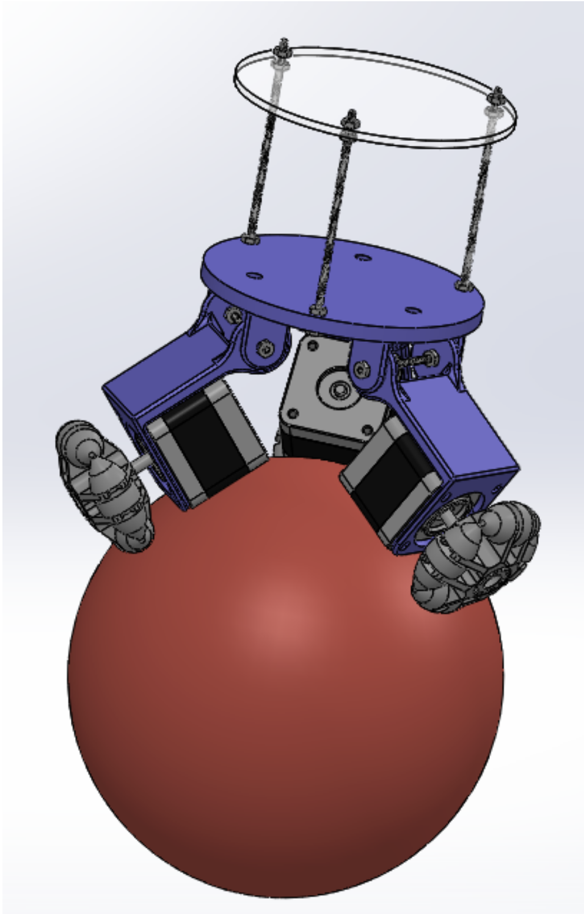
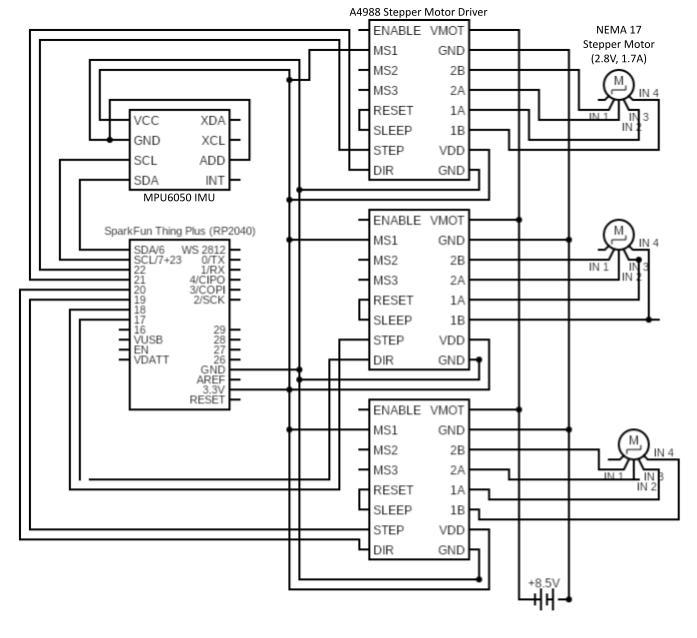
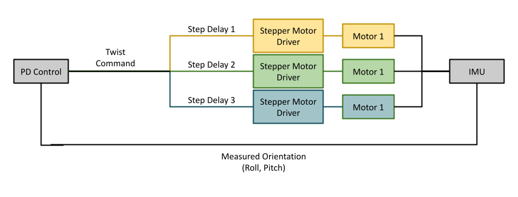

# Ball_Balancing_Robot

For my winter quarter independent study project, set out to build my own version of a BallBot, a dynamically stable / statically unstable robot. I am designed my bot from CAD to control algorithm, utilizing 3D printing, laser cutting, and C programming on an RP2040 microcontroller. 

https://youtu.be/7S1Z_5BLMUo

### Hardware
* RP2040 ThingPlus Microcontroller 
* MPU6050 Stepper Motor Driver (x3)
* A4988 Stepper Motor Driver (x3)
* NEMA 17 Stepper Motors (x3) 

### Chassis Design
The chassis was built with a combination of 3D printed components and laser cut plates.
In addition to self-fabricated pieces, the following components were purchased:
* 2-3/8" Diameter x 1" Wide Omnidirectional Wheels from McMaster-Carr (https://www.mcmaster.com/2289T514/)
* 4-40 Aluminum threaded rodd
* 4-40 Hex Nuts
* 4-40 Hex Screws
* Rubber Washers (0.190" ID, 1/2" OD)

  
   

### Electronics Assembly
The circuit was spread across three small breadboards, with an external power supply providing 8.5 volts to the motor drivers and a laptop providing 3.3V to the micocontroller. In future iteration, the power source would ideally be a battery with a volage regulator supplying both motor and logic power.

### Controls
The provided code demonstrates a PD feedback loop in which the IMU samples accelerometer and gyroscope data, uses a rolling average followed by a complimentary filter to calculate roll and pitch, and then generates a desired x and y velocity based on the deviation from 0. The IMU is initially calibrated such that 0 pitch and 0 roll can be considered a stable, upright system. The controll loop runs on a 500 Hz timer with the IMU sampled every 2 ms. The optimal Kp and Kd were found to be .29 and .27 respectively, however, these will likely vary depending on a variety of factors unique to each build. 

